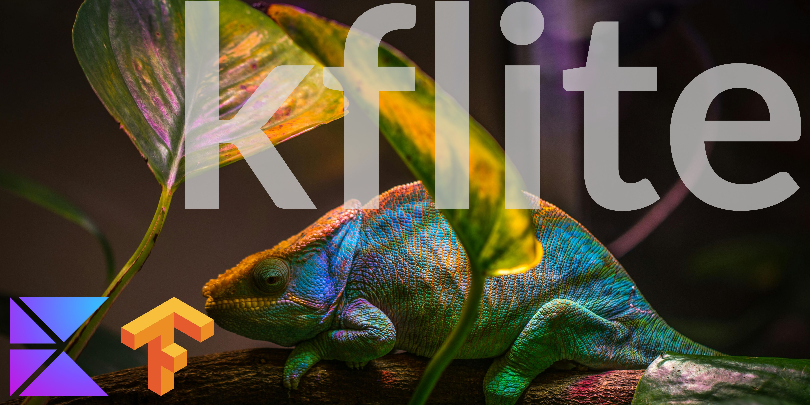

<a href="http://www.wtfpl.net/"></a>
[](https://kotlinlang.org/)
[](https://gradle.org/)



<p align="center">kflite is a Kotlin Multiplatform library to run TensorFlow lite models on iOS and Android targets.</p>

<p align="center">I would say kflite is a fresh and improved version of <a href= "https://github.com/icerockdev/moko-tensorflow">moko tensorflow</a> with better
support. It use `composeResources` and no need for platform-specific code.</p>

## Getting Started
### Adding dependencies
1- Add it in your `commonMain.dependencies` :

  ```
  implementation("io.github.shadmanadman:kflite:0.70.1")
  ```
2- Because KMP dos not pull the CocoaPods dependencies into your consumer project,
you need to add tflite dependency for ios manually. Prepare your project to use cocoapods and add the following dependency:
```
    iosX64()
    iosArm64()
    iosSimulatorArm64()


    cocoapods {
        summary = "Some description for the Shared Module"
        homepage = "Link to the Shared Module homepage"
        version = "1.0"
        ios.deploymentTarget = "16.0"
        podfile = project.file("../iosApp/Podfile")
        pod("TensorFlowLiteObjC", moduleName = "TFLTensorFlowLite")
        framework {
            baseName = "ComposeApp"
            isStatic = true
            linkerOpts(
                project.file("../iosApp/Pods/TensorFlowLiteC/Frameworks").path.let { "-F$it" },
                "-framework", "TensorFlowLiteC"
            )
        }
    }
```
If you get the following error during ios build:
```
clang: error: linker command failed with exit code 1 (use -v to see invocation)
```
That is a linker error. It simply means the Cocoapods framework is not linked correctly to your ios app. 
#### You can refer to [KfliteSample](https://github.com/shadmanadman/kflite-sample) for a clear vision.

### Place model
kflite uses the new compose resources. So you just place your model in the `composeResources->files` folder.

### Run model
You don't need any platform specific code, just commonMain.

1- Call init on `Kflite` and pass the model as byte array:
```
  Kflite.init(Res.readBytes("files/efficientdet-lite2.tflite"))
```
2- Prepare the input data:
```
  // Prepare input data: Example model takes 4D array as an input, an image with 480x480 pixels
  val inputImageWidth = Kflite.getInputTensor(0).shape[1]
  val inputImageHeight = Kflite.getInputTensor(0).shape[2]
  val modelInputSize =
      FLOAT_TYPE_SIZE * inputImageWidth * inputImageHeight * PIXEL_SIZE
      
  // Creates ByteBuffer to hold the image data    
  val inputImage =  imageResource(Res.drawable.example_model_input).toScaledByteBuffer(
                    inputWidth = inputImageWidth,
                    inputHeight = inputImageHeight,
                    inputAllocateSize = modelInputSize
                )   
```
3- Prepare the output data:
```
   // Prepare output data: Example model has 3D array as an output
   val firstOutputShape = Kflite.getOutputTensor(0).shape[0]
   val secondOutputShape = Kflite.getOutputTensor(0).shape[1]
   val thirdOutputShape = Kflite.getOutputTensor(0).shape[2]

   val modelOutputContainer = Array(firstOutputShape) {
       Array(secondOutputShape) {
           FloatArray(thirdOutputShape)
       }
   }
```
4- Run the model:
```
  Kflite.run(listOf(inputImage), mapOf(Pair(0,modelOutputContainer)))
```
5- Close the model after use:
```
  Kflite.close()
```
### Normalizing
You can normalize the model output:
```
val normalizedBox = Normalization(
        originalImageHeight = 1080f, //Original input height
        originalImageWidth = 2010f, // Original input width
        modelImagWidth = 680f, //Model input width
        modelImageHeight = 680f //Model input height
    ).YOLO(
        center_x = 20f, //CenterX of Model Output From The Model
        center_y = 20f,//CenterY of Model Output From The Model
        width = 100f,  //Width of Model Output From The Model
        height = 120f //Height of Model Output From The Model
    )
```
The `normalizedBox` will be a data class contain the new ordinations. You can use it to point the object 
or create a bounding box.

**Other supported Formats:**
- `Normalization.pascalVOC(x_min, y_min, x_max, y_max)`
- `Normalization.coco(x, y, width, height)`
- `Normalization.yolo(cx, cy, width, height)`
- `Normalization.tfObjectDetection(top, left, bottom, right)`
- `Normalization.tfRecordVariant(x_min, y_min, x_max, y_max)`

## What's next
- Live detection with Camera feed

## Licence
```
               DO WHAT THE FUCK YOU WANT TO PUBLIC LICENSE 
                    Version 2, December 2004 

 Copyright (C) 2025 Shadman Adman <adman.shadman@gmail.com> 

 Everyone is permitted to copy and distribute kflite or modified 
 copies of this license document, and changing it is allowed as long 
 as the name is changed. 

            DO WHAT THE FUCK YOU WANT TO PUBLIC LICENSE 
   TERMS AND CONDITIONS FOR COPYING, DISTRIBUTION AND MODIFICATION 

0. You just DO WHAT THE FUCK YOU WANT TO.
```


